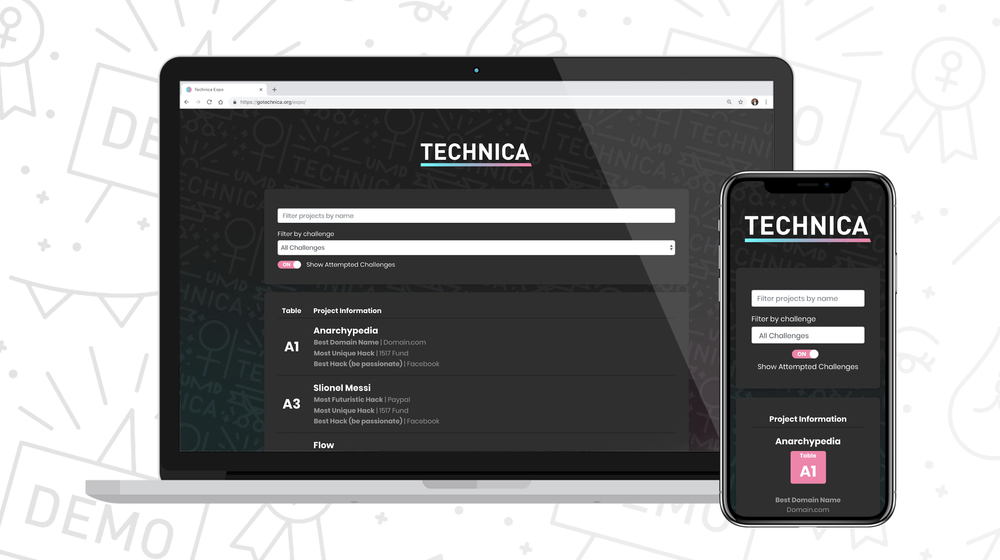
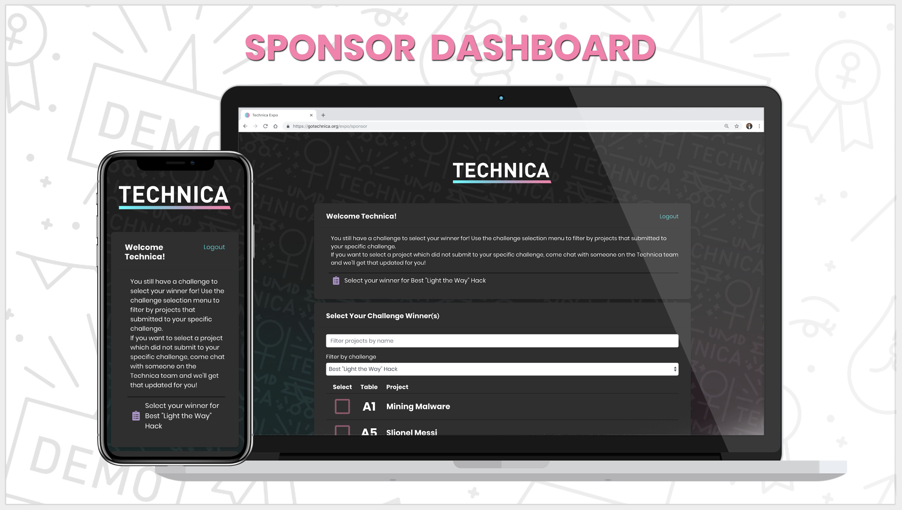
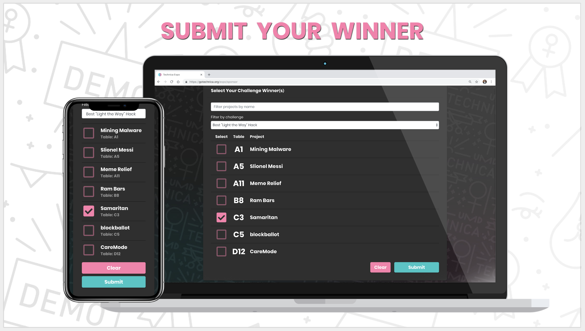
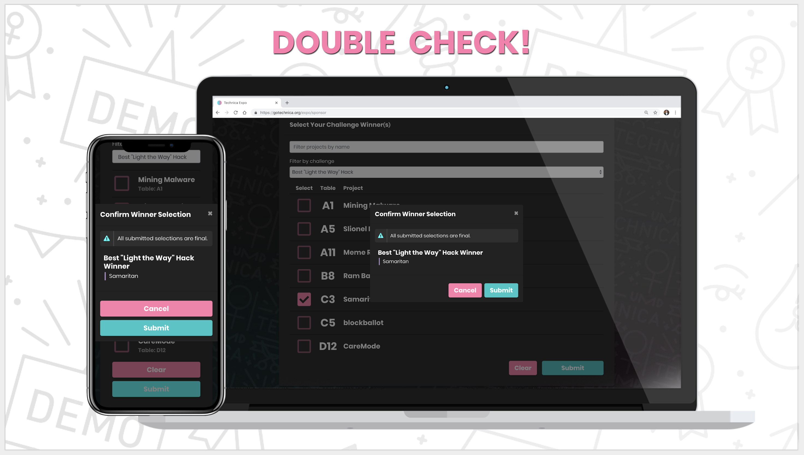
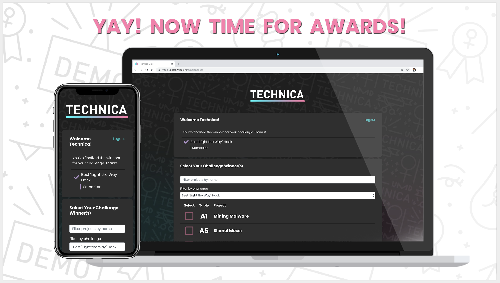
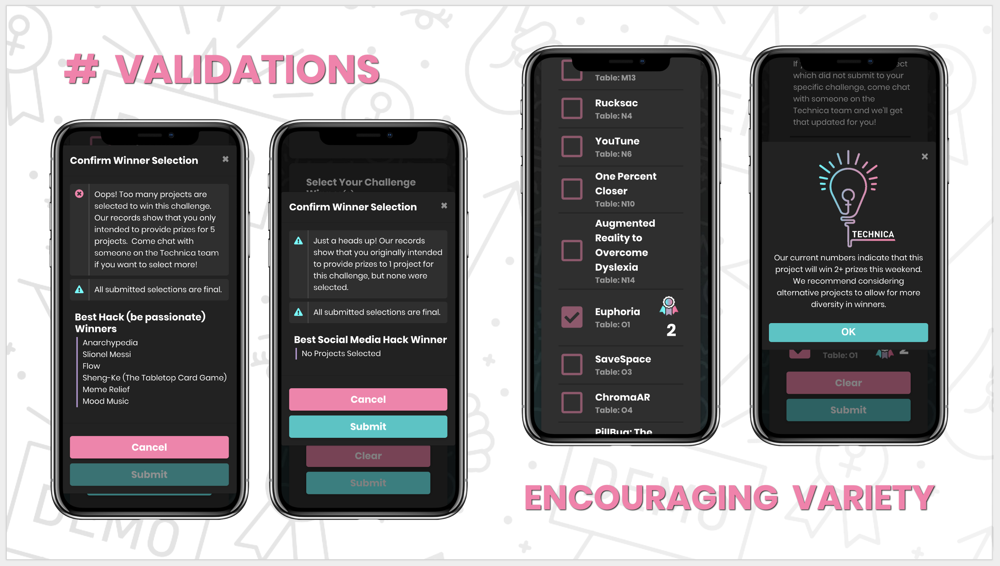

# Hackathon Expo App



A beautiful and intuitive web app to display hackathon projects for expo
attendees, hackers, and sponsors to locate or learn more info about a hack.
This web app also provides powerful admin and sponsor features beyond a basic
display website, including:

* Admin dashboard
    * Import project data from .csv files (from Devpost)
    * Automatically or manually assign table numbers to projects
    * CRUD project data on the fly
* Sponsor winner selection
    * Access code secure login
    * Sponsors can select projects as winner(s) for their challenges (so the organizing team can have a record of winners)
    * UI warning if a project is winning too many challenges (to avoid one project sweeping all prizes)

## Page URLs

Starting from localhost in a development environment, use the following links to
access this application.

- Home `/`
- Sponsor Login `/sponsorlogin`
- Sponsor Dashboard `/sponsor`
- Admin Login `/adminlogin`
- Admin Dashboard `/admin`

## Contribution Guidelines

Whenever you make an improvement, please *submit a pull request*
(never push to master).

Make sure your commit messages are consistent with these guidelines (from
[here](https://chris.beams.io/posts/git-commit/)):

- Separate subject from body with a blank line
- Limit the subject line to 50 characters
- Capitalize the subject line
- Do not end the subject line with a period
- Use the imperative mood in the subject line (e.g. Clean your room, Close the door, Take out the trash)
- Wrap the body at 72 characters
- Use the body to explain what and why vs. how

If you're working on improving the Flask app, please use PEP 8 Python style
guide! You can find the linter for Atom
[here](https://atom.io/packages/linter-python-pep8).

## Hackathon Organizer Playbook

### Before the Hackathon

- Deploy all of the services for this expo app.
- Create your Devpost and add your sponsor's challenges (or your own!) - make
  sure to follow the [Devpost Guidelines](#devpost-guidelines) outlined below!
- Log in as `admin` and add sponsors and assign unique access codes (or leave
  blank input boxes to auto-generate an unique 8-character access code).
- Add the challenges to each sponsor (*important:* when naming the challenge,
  make sure it is exactly the same string as you created in Devpost, but remove
  the ` - company_name` portion (e.g. if you have a challenge in Devpost that
  says `Best Hack to Transform Transportation - Lyft`, you should add a
  challenge of the name `Best Hack to Transform Transportation` in the admin
  console)).
- Prepare some form of communication to give your sponsors their access codes
  and login link.

### Before The Expo
- Hold sponsor briefing to give winner selection instructions and guidelines.

### After Devpost submission deadline ends
- Export projects from Devpost in CSV format
- Seed projects into DB via admin dashboard
- Assign table numbers via admin dashboard

### Monitoring expo progress
- Sponsors should be actively submitting in their winner selections as they
  finish judging their challenges - this can be monitored via the admin dashboard

### After the Hackathon
- From the network tab, access your `/expo` page and copy/paste the `/projects` and `/challenges` responses into json files (stored in `expo/src/responseData` named `projects.json` and `challenges.json`).
- In `Backend.js`, flip the `useCachedResponseData` flag to true. This will turn off all routes except for the homepage (`/expo`) and pull data from the cached json files. After re-deploying your React app, you can turn off your database and the flask server.

## Sponsor Instructions
Log in with your access code at gotechnica.org/expo/sponsor


Welcome to your sponsor dashboard! This is where you’ll select the winner(s) of your challenge. For those of you who have multiple challenges, you’ll be selecting the winner or winners for each of your challenges, one at a time. Please use the “Filter by challenge” dropdown box to select which challenge you’re currently selecting the winner for. If you only have one challenge you’re judging today, don’t worry about the filter dropdown!
If you come across a team who you’d like to award your prize to, but they didn’t specifically submit to your challenge, don’t worry! Just come to talk to one of us and we can get that updated for you :)



When you’re ready to select your winner (or multiple winners), click the checkbox (or checkboxes) next to the project and then scroll all the way down and click Submit.



Please make sure you’ve selected the correct team before you submit your final decisions!



Once you’re finished, you’ll be able to see the checkmark (or checkmarks) next to each of your challenges.



A few other things that we’ve built into our system to hopefully make your lives easier:

1. We’ve gone into our database and recorded how many prizes you’re planning on giving based on the pre-event info you sent us. You can select less teams than you originally wanted to give out prizes for, but if you want to select more than you originally told us (for most of you, this limit is 1 team), just come speak with one of us! The reason we implemented this upper cap is to make sure you have enough prizes for the teams you’ve selected, and it wasn’t just an accidental submission. Better safe than sorry!
2. We really want to encourage as many individuals as possible, and one of the ways is making sure we have a good variety of winners and not just one team taking home all the gold. If a team has already won two prizes (based on what other sponsors have submitted in our system), then we’ll pop up a reminder so that you know that this project has already been picked. If that shows up, we’d encourage you to select another project as your challenge winner!



Happy judging!


## Devpost Guidelines

v1 of this expo app makes a few assumptions about how Devpost is set up. Not
following these requirements may lead to unexpected behavior in your deployment.

- Challenge names should be formatted as `challenge_name - company_name` (e.g.
  `Best Hack to Transform Transportation - Lyft` or `Funniest Hack - Technica`).
  This is a temporary workaround that will be resolved in a future release.
- The challenge name portion (not including company name) should not be a
  substring of another challenge (e.g. `Funniest Hack I - Technica` and
  `Funniest Hack II - Technica` is not valid since `Funniest Hack I` is a
  substring of `Funniest Hack II`). This is a temporary workaround that will be
  resolved in a future release.
- You can create a custom field for hacks that need to stay at their current table.
  To do this, you can configure the environment/config variable in your
  `api/config.py` file. This string should be labeled exactly as you configured in
  Devpost (e.g. `Does your hack need to stay at your current table? (i.e. hardware,
  VR/AR hacks). If so, what table number are you at?`).


## Deployment

### Middleware

One way to deploy the application is to use a WYSWG server to host the Flask app
locally, and use Nginx to reverse proxy incoming requests. One WYSWG server is
Gunicorn, which can be installed with:

```bash
$ pip3 install gunicorn
```

Once Gunicorn is installed, navigate to the `api/` directory and run:

```bash
$ gunicorn -b 0.0.0.0 server:app
```

This will host the application locally on port `8000`.

Port 8000 should not be exposed to the public, as it is currently being served
via HTTP. Expose ports `80` and `443`, and set install Nginx.

### Certificates

Once Nginx is installed, also install CertBot and the `python-certbot-nginx`
plugin.

Once Nginx is running, you can then set up a certificate with:

```bash
$ sudo certbot --nginx -d your.domain.here.com
```

and follow the prompts to install the certificate.

Inside your `/etc/nginx/nginx.conf`, there should be a block that looks like:

```
server {
    server_name your.domain.here.com; # managed by Certbot
        root         /usr/share/nginx/html;

        # Load configuration files for the default server block.
        include /etc/nginx/default.d/*.conf;

        location / {
                proxy_pass http://localhost:8000$request_uri;
                proxy_set_header Host $host;
        }

        error_page 404 /404.html;
            location = /40x.html {
        }

        error_page 500 502 503 504 /50x.html;
            location = /50x.html {
        }

    listen [::]:443 ssl ipv6only=on; # managed by Certbot
    listen 443 ssl; # managed by Certbot
    ssl_certificate /etc/letsencrypt/live/your.domain.here.com/fullchain.pem; # managed by Certbot
    ssl_certificate_key /etc/letsencrypt/live/your.domain.here.com/privkey.pem; # managed by Certbot
    include /etc/letsencrypt/options-ssl-nginx.conf; # managed by Certbot
    ssl_dhparam /etc/letsencrypt/ssl-dhparams.pem; # managed by Certbot
}
```

You'll want to comment out the `root` command, and modify the `location` block
as follows:


```
#root         /usr/share/nginx/html;

...

location / {
        proxy_pass http://localhost:8000$request_uri;
        proxy_set_header Host $host;
}
```

This will allow for Nginx to properly forward requests to the Gunicorn server
and not host the default landing page.

Let's Encrypt certificates only last for 90 days, so when they expire, you will
need to run

```
$ sudo certbot renew
```

to renew your certificates.

### Securing Nginx

To get an SSL A+ grade, you'll need to generate a secure DH group with OpenSSL
and add a few headers to the Nginx configuration. The headers are used to
prevent HTTPS downgrade attacks and to prevent vulnerable TLS versions or
ciphers from being used.

To generate a secure DH group, run:

```bash
$ sudo openssl dhparam -out /etc/ssl/certs/dhparam.pem 2048
```

and change the `ssl_dhparam` path to `/etc/ssl/certs/dhparam.pem`.

Add the following commands within the `server` block:

```
ssl_ciphers 'ECDHE-RSA-AES128-GCM-SHA256:ECDHE-ECDSA-AES128-GCM-SHA256:ECDHE-RSA-AES256-GCM-SHA384:ECDHE-ECDSA-AES256-GCM-SHA384:DHE-RSA-AES128-GCM-SHA256:DHE-DSS-AES128-GCM-SHA256:kEDH+AESGCM:ECDHE-RSA-AES128-SHA256:ECDHE-ECDSA-AES128-SHA256:ECDHE-RSA-AES128-SHA:ECDHE-ECDSA-AES128-SHA:ECDHE-RSA-AES256-SHA384:ECDHE-ECDSA-AES256-SHA384:ECDHE-RSA-AES256-SHA:ECDHE-ECDSA-AES256-SHA:DHE-RSA-AES128-SHA256:DHE-RSA-AES128-SHA:DHE-DSS-AES128-SHA256:DHE-RSA-AES256-SHA256:DHE-DSS-AES256-SHA:DHE-RSA-AES256-SHA:AES128-GCM-SHA256:AES256-GCM-SHA384:AES128-SHA256:AES256-SHA256:AES128-SHA:AES256-SHA:AES:CAMELLIA:!DES-CBC3-SHA:!aNULL:!eNULL:!EXPORT:!DES:!RC4:!MD5:!PSK:!aECDH:!EDH-DSS-DES-CBC3-SHA:!EDH-RSA-DES-CBC3-SHA:!KRB5-DES-CBC3-SHA';
ssl_protocols TLSv1.2;
ssl_session_timeout 1d;
ssl_session_cache shared:SSL:50m;
ssl_stapling on;
ssl_stapling_verify on;
add_header Strict-Transport-Security max-age=15768000;
```

A brief description of the important options is as follows:

* `ssl_ciphers`: List which ciphers are supported (colon seperated) or disabled
  (with `!` prefixed)
* `ssl_protocols`: Which versions of TLS are supported. Don't use anything older
  than v1.2 due to Heartbleed.
* `add_header Strict-Transport-Security`: forces HSTS to prevent HTTPS
  downgrade attacks.
