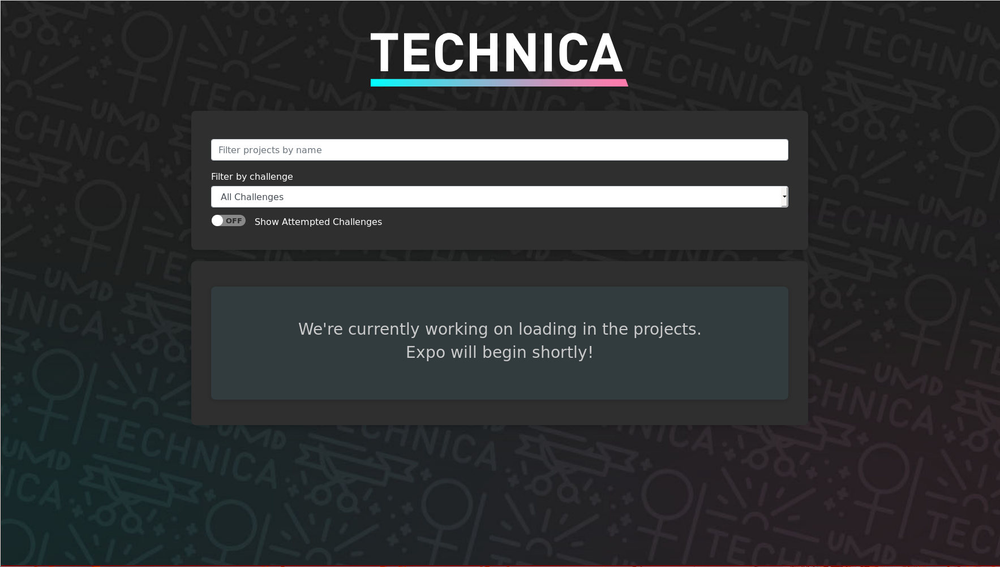
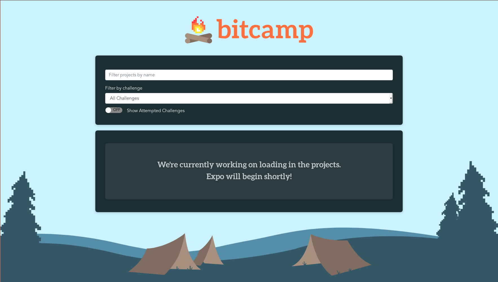

# Customizing Expo for your Hackathon

All the assets and styles for Expo can be customized.

## HTML
Edit `public/index.html`, `public/404.html` to have the proper title.

## Javascript

In `customize.js`, there are two sets of parameters that can be edited:
- `table_color` Alternating row colors in expo list
- `hackathon_name` String name of the hackathon

## Images
In `imgs`, there are three images you can replace.

- `background.jpg` Background image for the app
- `hackathon-logo.svg` Logo for the top
- `winner_ribbon.png` Ribbon to be displayed on winning apps

## Styles
We have a ton of css variables you can edit.

Most colors have a normal and `-darker` variant. The `-darker` variant is the neutral state for a button, while the 'normal' version will be the lit-up hover state.

The main colors you can customize are documented here:

### Main colors
- `primary-action` Color for primary actions, such as creation, publishing, etc.
- `cancel-action` Color for cancel actions, such as exiting a modal.
- `warning` Color for warnings, such as delete buttons.

### Supporting colors
- `supporting-primary` Supporting color scheme. Used as element backgrounds.
- `app_background_banner` Defaults to `background.png` from above. Comment out if you want a solid color background.
- `app_background_color` Soild color background for loading, or when there is no background.

## Examples
By just replacing a few assets and styles, you can get a whole new look, while still keeping all the functionality.

